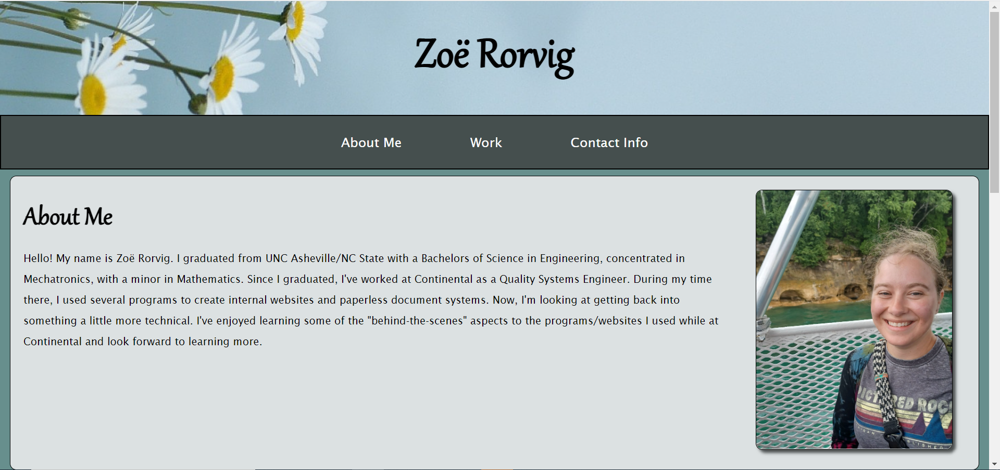
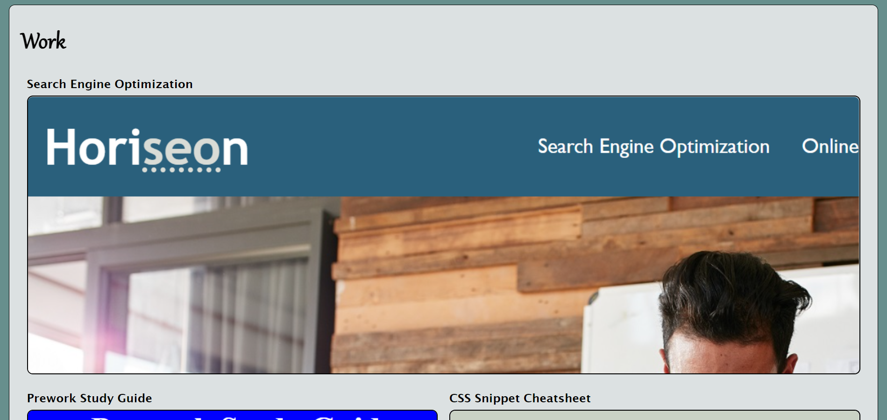
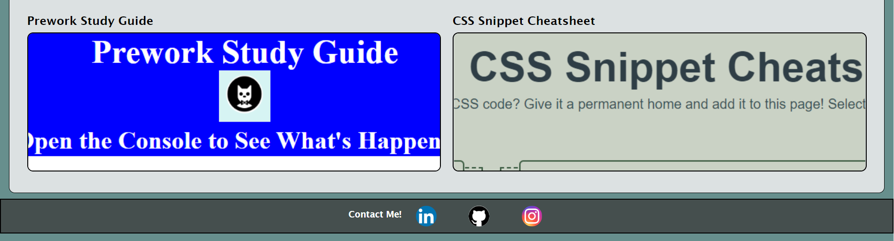
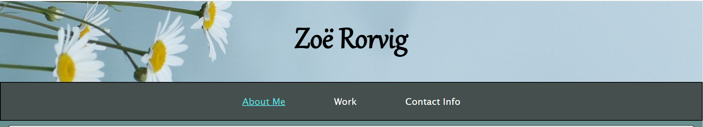
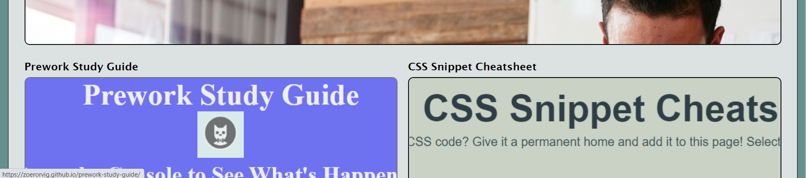
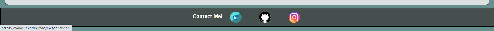

# my-portfolio

[Link to My Project](https://zoerorvig.github.io/my-portfolio/)

## Table of Contents
- [Description](#description)
- [Visuals](#visuals)

## Description 

This portfolio is is meant to highlight a few of Zoe Rorvig's projects and tell a little bit about her, including an "About Me" section and contact information.

Included Features:
- Name is featured in the header with a background picture. 
- Navigation bar links to three sections: About Me, Work, and Contact Info.
- 

## Visuals 

The following are screenshots of the full webpage:

The following screenshot shows the linkage and text decoration in the navigation bar:

The following screenshot shows the linkage and picture decoration in the work section:

The following screenshot shows the linkage and icon decoration in the footer:

